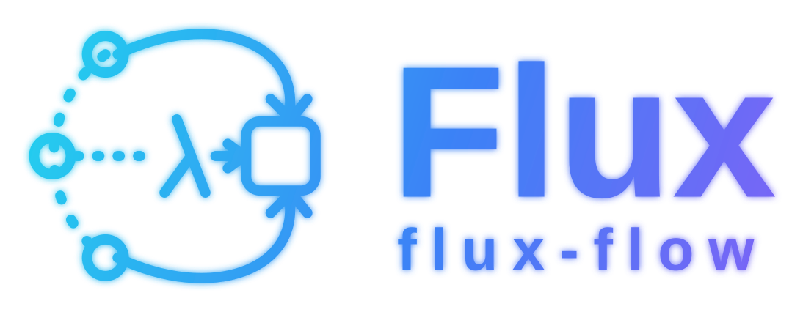

# flux

<p align="center">
  
</p>

[](https://github.com/codewandler/flux/actions/workflows/ci.yml)
[](https://github.com/codewandler/flux/releases/latest)
[](#license)

A Rust agent SDK, harness, and coding agent — **as easy to use as a zero-config REPL, as safe and
durable as a policy-gated platform**, with first-class extensibility (JavaScript hooks + any-language
subprocess plugins).

flux is a single Cargo workspace of small, strictly-layered crates: pure contracts at the core, a
mandatory safety envelope in the middle, and CLI / TUI / HTTP surfaces on top. Every tool call —
built-in, plugin, or sub-agent — passes through the same **authorization → approval → guarded-IO**
chain, so the agent can edit your code and run commands without being able to escape the workspace or
leak secrets.

---

## Install

**Prebuilt binary** — installs the `flux` binary into `~/.cargo/bin` (Linux, macOS, Windows; x86_64 +
aarch64):

```bash
# Linux / macOS
curl --proto '=https' --tlsv1.2 -LsSf https://github.com/codewandler/flux/releases/latest/download/flux-cli-installer.sh | sh
```

```powershell
# Windows (PowerShell)
powershell -ExecutionPolicy Bypass -c "irm https://github.com/codewandler/flux/releases/latest/download/flux-cli-installer.ps1 | iex"
```

**From source** — requires **Rust 1.85+** (`rustup update stable`):

```bash
cargo install --git https://github.com/codewandler/flux flux-cli
# …or clone and build: cargo build --release   → target/release/flux
```

Prebuilt binaries, installers, and checksums are attached to every
[tagged release](https://github.com/codewandler/flux/releases/latest).

---

## Quickstart

```bash
# one-shot (prints a streamed response)
flux -p "explain this repo's architecture"

# interactive REPL (tools enabled, session auto-saved); /help for commands
flux

# ratatui TUI with live token streaming + in-TUI approval modal
flux --tui

# agentic one-shot that can edit files / run commands under the safety envelope
flux --agent "add a test for the parser"     # prompts for approval; --yes to auto-approve

# resume the most recent session (optionally with a new prompt)
flux -c
flux -c -p "now add tests"

# HTTP daemon (REST + SSE streaming)
flux --serve 127.0.0.1:8787 --yes
```

No network or API keys are needed to try the machinery: `-m mock` runs a built-in offline provider
through the full agent loop.

```bash
# try the full agentic loop offline — no API key needed
flux --agent --yes -m mock "summarise this repo"
```

---

## Providers & auth

A provider is a **wire codec × credential** cell. Pick one with `-m <provider>/<model>` (bare aliases
`opus`/`sonnet`/`haiku` resolve against Anthropic):

| `-m` provider | Wire | Auth | Notes |
|---|---|---|---|
| `anthropic` | Anthropic Messages | `ANTHROPIC_API_KEY` | API key |
| `claude` | Anthropic Messages | Claude subscription OAuth | imports `~/.claude/.credentials.json`; opt-in |
| `openai` | OpenAI | `OPENAI_API_KEY` | API key |
| `codex` | OpenAI Responses | ChatGPT/Codex OAuth | imports `~/.codex/auth.json`; opt-in |
| `openrouter` | OpenAI Chat | `OPENROUTER_API_KEY` | API key |

```bash
flux auth status                 # what's available and from where
flux auth login claude           # PKCE login for the Claude subscription path
flux -m claude/opus -p "hi"
flux -m openrouter/anthropic/claude-sonnet-4.5 -p "hi"
```

Thinking depth: `--think` toggles adaptive thinking; `--effort low|medium|high|xhigh|max` controls it.

> The subscription paths (`claude`, `codex`) reuse your existing CLI credentials. They are opt-in and
> never the default; the API-key paths are the supported way to run flux.

---

## Configuration (`.flux/config.toml`)

Precedence: CLI flags > project `.flux/config.toml` > user `~/.flux/config.toml` > defaults.

```toml
model = "claude/opus"            # default model (a -m flag overrides)
allow_private_net = false        # let web_fetch / plugins reach loopback/private addresses

[permissions]                    # rules: deny wins, then allow, otherwise prompt
allow = ["read", "glob", "grep", "search", "Bash(git:*)"]
deny  = ["Bash(rm:*)"]

[[policy.grants]]                # optional fine-grained authorization grants (extends defaults)
subjects  = [{ kind = "user", id = "*" }]
resources = [{ kind = "path", path = "src/**" }]
actions   = ["workspace.write"]
```

"Always-allow" choices from approval prompts are persisted back here automatically.

---

## The safety model

Every tool call traverses a non-bypassable chain:

```
pre-tool hooks → authorization policy (default-deny) → permission rules → approval gate → guarded IO
```

- **Policy** (pure, default-deny): grants over subjects × resources × actions, gated by trust and
  scopes. A sensible local default keeps the agent working out of the box (read/write/network allowed,
  process-exec requires approval).
- **Destructive operations are forced to approval** even under a permissive allow-rule (`rm -rf`,
  `git push --force`, `mkfs`, …).
- **Guarded IO** is the only place real filesystem/process/network access happens — workspace-confined,
  symlink/escape-rejecting, **argv-only** (no shell injection), with an SSRF-guarded fetch.
- **Secrets** are scrubbed from tool output and logs.
- **Evidence**: observations (tool calls, destructive markers, skill activations, compaction) are
  recorded and surfaced as events.

Sub-agents inherit the same policy and refuse destructive operations.

---

## Capabilities

- **Built-in tools:** `read`, `write`, `edit`, `bash`, `glob`, `grep`, `web_fetch` (SSRF-guarded),
  `search` (auto-indexed workspace docs), `task` (delegate to a sub-agent role).
- **Skills** (`.flux/skills/*.md` with `triggers:` frontmatter): matched per-turn against your input
  and injected into that turn's prompt.
- **Sub-agent roles** (`.flux/agents/<role>.md`): scout / planner / worker / reviewer / evaluator /
  summarizer (built-in defaults; override with your own).
- **Plugins** (`~/.flux/plugins/*.toml`): any-language subprocess binaries over a framed protocol;
  their operations become policy-gated tools, and they call back to host capabilities
  (`process.run` / `secret` / `http.do`) through the guarded boundary. A plugin gets **only** the
  capabilities it declares in its manifest — the host grants an allow-list of runnable programs and
  readable secret keys (and an `http` toggle) and checks every callback against it.
  - `flux plugin add <name> <program> [args…] | ls | pin <name> <ver> | rollback <name>`
- **Hooks** (`.flux/hooks/*.js`): pre-tool observe / modify / deny in JavaScript.

### REPL / autopilot commands

```
/help  /tools  /session  /clear
/model <spec>       switch model/provider mid-session (e.g. /model opus)
/sessions           list recent sessions; /resume <id> reattaches to one
/pd <goal>          plan-and-dispatch: planner → parallel dependency waves of workers
/goal <condition>   drive turns toward a goal, judged by an evaluator sub-agent
/loop <n> <task>    run a task up to n times
/exit               (Ctrl-C interrupts a running turn or command; Ctrl-D exits)
```

The REPL has line editing, persistent history, and reverse-search; `flux sessions` lists past
sessions from the shell.

Long sessions are **compacted** automatically: older turns are summarized into a synthetic message once
the session passes a budget (`FLUX_COMPACT_CHARS`, default 48k characters; `0` disables).

---

## HTTP API (`flux --serve`)

| Route | Purpose |
|---|---|
| `GET  /health` | liveness |
| `POST /sessions` | create a session → `{ id, model }` |
| `GET  /sessions/:id` | session info |
| `POST /sessions/:id/messages` | run a turn → `{ text, tool_calls, usage }` |
| `GET  /sessions/:id/stream?input=…` | **Server-Sent Events**: `text` / `tool` / `done` |
| `POST /webhook` | external trigger → fresh session + one turn |

The daemon auto-approves tool calls, so it is access-controlled: every route except `GET /health`
requires `Authorization: Bearer $FLUX_SERVER_TOKEN`. A non-loopback bind without `FLUX_SERVER_TOKEN`
set is refused; loopback may run tokenless for local use.

---

## Library use (`flux-sdk`)

```rust
let provider = Box::new(flux_anthropic::anthropic_from_env()?);
let client = flux_sdk::Client::builder().model("anthropic/opus").build(provider, ".")?;
let out = client.run("Summarize the README").await?;
println!("{}", out.text);
```

---

## Architecture

flux is a workspace of strictly-layered crates; inner crates never depend on outer ones (enforced by a
test). See [docs/architecture.md](docs/architecture.md) for the full design and the safety envelope,
[docs/vision.md](docs/vision.md) for the project's direction and principles, and
[AGENTS.md](AGENTS.md) for the crate map and contributor guide.

- **Contracts (pure):** core types, authorization policy, secrets, tool specs, config, evidence, skills
- **Providers:** the provider abstraction + Anthropic/OpenAI clients + credentials
- **Runtime:** the guarded IO boundary, the safety envelope, built-in tools, sessions, context
- **Agent:** the agent loop + multi-agent orchestration
- **Extensibility:** JavaScript hooks + subprocess plugins
- **Capabilities:** browser/web, datasource/RAG, caller identity
- **Surfaces:** the SDK, HTTP server, integrations, TUI, and the `flux` CLI

---

## Development

```bash
cargo test --workspace                                   # all tests
cargo clippy --workspace --all-targets -- -D warnings    # lints
cargo fmt --all --check                                  # formatting
cargo test -p flux-codegate                              # architecture layering lint
```

CI runs all of the above on every pull request. See [CHANGELOG.md](CHANGELOG.md) for release notes,
[docs/roadmap.md](docs/roadmap.md) for status and what's next, and [AGENTS.md](AGENTS.md) if you're
contributing (human or agent).

## License

MIT OR Apache-2.0
