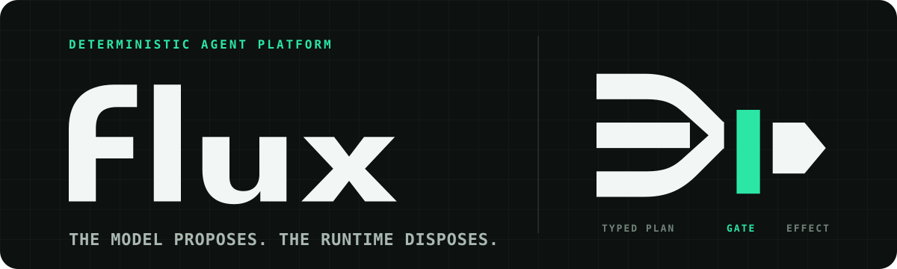
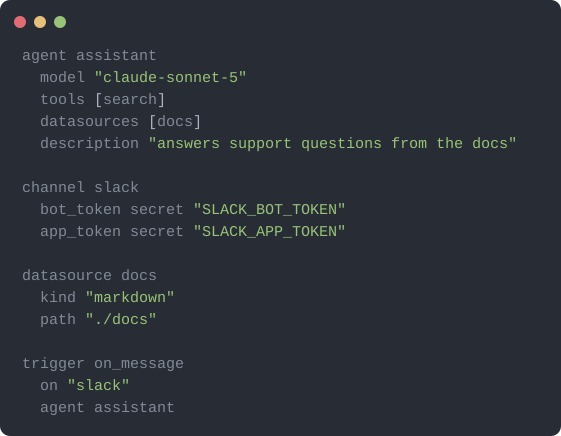

<h1 align="center">
  
</h1>

<p align="center">
  <strong>A Rust agent platform where the model proposes and a deterministic runtime disposes.</strong><br>
  Typed stages, authored flows, guarded execution, replayable evidence.
</p>

<p align="center">
  <a href="https://github.com/codewandler/flux/actions/workflows/ci.yml"></a>
  <a href="https://github.com/codewandler/flux/releases/latest"></a>
  <a href="https://codewandler.github.io/flux/"></a>
  <a href="#license"></a>
</p>

<p align="center">
  <a href="#install"><strong>Install</strong></a> ·
  <a href="#quickstart"><strong>Quickstart</strong></a> ·
  <a href="https://codewandler.github.io/flux/"><strong>Documentation</strong></a> ·
  <a href="docs/architecture.md"><strong>Architecture</strong></a> ·
  <a href="AGENTS.md"><strong>Contributing</strong></a>
</p>

---

## The LLM is not the runtime

The model never becomes the execution engine. It may author Flux-Lang source, declare intent,
explore through exact provider-native operation schemas, and propose literal actions, but authored
text is inert until it is parsed and analysed. Only an explicitly requested run enters the
deterministic Rust runtime, where authorization, approval and guarded IO own every effect.

```text
request → typed intent → scoped exploration → action batch → approval → guarded execution
                       authored Flux-Lang + deterministic runtime
```

That boundary is what makes effects reviewable *before* they run, authored workflows repeatable, and
every operation governable. The same envelope covers local tools, plugins, sub-agents, the SDK and the
server — there is no second path.

## An entire app, declared

A Slack support agent: the agent, the channel it answers on, the corpus it answers from, and the
trigger that wakes it.

<p align="center">
  
</p>

```bash
flux app run support-bot.flux
```

Secrets are environment-variable *references*, never inline values — the host resolves them at load and
redacts them from every log. The full example, with setup notes, is
[`crates/flux-app/examples/support-bot.flux`](crates/flux-app/examples/support-bot.flux).

## Why flux

| | |
| --- | --- |
| **Agent** | Local CLI and TUI, a Rust SDK, an HTTP server, A2A support — one execution envelope behind all four. |
| **Flux-Lang** | Typed authored flows for orchestration, with an in-repo language server (diagnostics, completion, hover, formatting) and a [tree-sitter grammar](https://github.com/codewandler/flux-tree-sitter) for Helix, Neovim and Zed. |
| **Improvement loop** | Evidence-driven eval and self-improvement tooling. |

Reach for flux when you want an action batch you can inspect and approve before it runs, guardrails
that are explicit rather than implied, deterministic replay/fork/diff, or an embeddable agent surface
inside your own product.

## Install

```bash
cargo install --git https://github.com/codewandler/flux flux-cli

# optional: the .flux language server for your editor
cargo install --git https://github.com/codewandler/flux flux-lsp
```

Or take a prebuilt binary for Linux and macOS:

```bash
curl --proto '=https' --tlsv1.2 -LsSf -o flux-installer.sh \
  https://github.com/codewandler/flux/releases/latest/download/flux-cli-installer.sh
sh flux-installer.sh   # downloaded first, so the script is reviewable before it runs
```

<details>
<summary><strong>Hardened install — verify GitHub provenance before extracting</strong></summary>

For sensitive environments, pin a version and verify its attestation. Replace the placeholders with a
release and target from the [release page](https://github.com/codewandler/flux/releases/latest):

```bash
release=vX.Y.Z
archive=flux-cli-<target>.tar.xz
gh release download "$release" --repo codewandler/flux --pattern "$archive"
source_digest="$(gh api "repos/codewandler/flux/commits/$release" --jq .sha)"
gh attestation verify "$archive" --repo codewandler/flux \
  --signer-workflow codewandler/flux/.github/workflows/release.yml \
  --source-ref "refs/tags/$release" --source-digest "$source_digest" \
  --deny-self-hosted-runners
tar -xJf "$archive"
```

Verification binds the tag to its exact source commit and rejects any asset outside the closed,
attestation-checked distribution set. Releases predating provenance publication should be built from a
reviewed tag instead.

</details>

From a clone: `cargo build --release` → `target/release/flux`, or `task install` for `flux` and
`flux-lsp` together. `task install` requires Python 3.10+ before Cargo starts (`python3`, then
`python` on Linux/macOS; `python`, then `py -3` on Windows). It preserves an absolute or
workspace-relative `CARGO_TARGET_DIR`, holds shared ownership of that reusable target for the whole
verification/install sequence, and refuses concurrent `task clean` rather than risking live
compiler output. Set `PYTHON=<executable>` only when the platform's standard launcher is not the
desired interpreter. Plugin packs ship separately as `plugins-v*`.

## Quickstart

No API key required — the offline `mock` provider exercises the full pipeline:

```bash
flux run --yes -m mock "write a quick note"
```

```text
mock · session s_1658
routing intent…
◆ intent: complete the offline mock turn
  capabilities: workspace.write · 5 operations
exploring…

→ [1/50] append    flux-mock.txt (+21 bytes)
  ✓ appended 21 bytes to flux-mock.txt  · exec 731µs
Finished.
─────────────────────── 1 step · 790ms · ctx 1.4k · out 12 · cache 87% ↺1.2k ✎0
```

The intent, the capabilities it unlocked, every operation with its arguments and effect, and the cost.
Then with a real provider:

```bash
flux run "add a test for the parser"
flux run --show-loop "summarize README.md into SUMMARY.txt"   # reveal the batch machinery
flux loop show                                                # inspect the authored outer loop

flux            # REPL
flux tui        # full-screen UI
flux app run --serve 127.0.0.1:8787 --yes    # HTTP server
```

Effects are local by default. To keep the model, runtime and approval UI on your machine while file,
process and network effects land in a separately administered workspace, select the remote mode with
`flux tui --remote https://worker.example:8790`. The remote side is an authenticated TLS service;
setup, trust boundaries and the deliberate no-sync rule are covered in the
[topologies guide](https://codewandler.github.io/flux/topologies#local-runtime-remote-system).

## Safety and execution model

Every operation passes the same chain:

```text
capability scope floor → policy (deny by default) → permissions → approval → guarded IO
```

There is no bypass path:

- workspace file, process and network operations are guarded by `flux-system` — one path, not one of several
- unsafe or ambiguous commands can be denied at analysis time or at approval time
- effectful native calls are frozen into an approved batch and **re-checked at dispatch**
- every secret is registered with the redactor and scrubbed from tool output and logs
- evidence is persisted per session and per event, for audit and replay

Sub-agents inherit the identical chain: their loops and operation calls face the same checks.

## Providers

A provider is a **wire codec × credential** pair, selected with `-m <provider>/<model>`.

```bash
flux auth status
flux auth login claude   # opt-in OAuth
```

Bare aliases skip the prefix: `fable`, `opus`, `sonnet` and `haiku` resolve on `anthropic`; `claude`,
`codex` and `aws` resolve their provider's default model; `mock` runs offline.

<details>
<summary><strong>All providers and their credentials</strong></summary>

| `-m` provider | Wire | Auth |
| --- | --- | --- |
| `anthropic` | Anthropic Messages | `ANTHROPIC_API_KEY` |
| `openai` | OpenAI Chat | `OPENAI_API_KEY` |
| `openrouter` | Anthropic Messages | `OPENROUTER_API_KEY` |
| `ollama` | OpenAI Chat | local |
| `ollama-anthropic` | Anthropic Messages | local |
| `claude` | Anthropic Messages | Claude subscription OAuth (`~/.claude/.credentials.json`) |
| `codex` | OpenAI Responses | ChatGPT/Codex OAuth (`~/.codex/auth.json`) |
| `aws` | Bedrock Anthropic | AWS env / SSO / IRSA / EKS Pod Identity |
| `mock` | — | none — offline test provider, exercises the full pipeline |

</details>

## Configuration

Precedence: CLI flags → project `.flux/config.toml` → user `~/.flux/config.toml` → defaults.

<details>
<summary><strong>Example <code>.flux/config.toml</code></strong></summary>

```toml
model = "claude/opus"

[private_net]
web = ["localhost"]

[private_net.plugins]
prometheus = ["prometheus.local"]

[permissions]
allow = ["read", "glob", "grep", "search", "Bash(git:*)"]
deny  = ["Bash(rm:*)"]

[[policy.grants]]
subjects = [{ kind = "user", id = "*" }]
resources = [{ kind = "path", path = "src/**" }]
actions = ["workspace.write"]
```

`allow_private_net = true` is still honored for compatibility, but plugin private-network grants always
require an explicit `[private_net.plugins]` entry.

</details>

Full reference: [configuration](https://codewandler.github.io/flux/docs/reference/config).

## Capabilities

- Built-in tools cover file, search, web and delegation operations. The generic shell (`bash`) is
  **opt-in**, behind the `shell` signal — prefer a dedicated, accurately-gated operation.
- Skills and markdown slash-commands load from both `.flux/` and `.claude/` trees, project and
  user-global, nested multi-file skills included. Manual-only by default, with an opt-in
  model-invoked mode.
- Plugin operations are manifest-scoped with enforced privileges. Approval and policy hooks
  (`.flux/hooks/*.js`) can validate, transform or deny calls.
- `flux tui` is the same daily driver in a dense borderless UI: mid-turn steering (type while a turn
  runs, with queued messages still editable), themes, history and transcript search, `@` path
  completion, hunk-view diffs, session picker and replay, live model switching.

## Programs, presets, and the SDK

Programs compose multi-agent journeys in Flux-Lang — a `.flux` file declaring agents, channels,
datasources, triggers and journeys. Presets cover common flow structures.

```bash
flux app run support-bot.flux            # serve its declared channels until Ctrl-C
flux run support-bot.flux                # same program, path auto-detected
flux run workflows.flux --entry triage --arg queue=new   # one named flow from a multi-flow module

flux preset list
flux preset retry_with_backoff max=3 delay_ms=200 op=read input='"README.md"' bind=r --run --yes
```

To embed flux in Rust, the SDK assembles the same flow engine and safety pipeline the CLI uses:

```rust
let provider = Box::new(flux_providers::anthropic::anthropic_from_env()?);
let client = flux_sdk::Client::builder().model("anthropic/opus").build(provider, ".")?;
let out = client.run("Summarize the README").await?;
println!("{}", out.text);
```

## Exchange integrations

Flux can mount the connected, granted operations of one Exchange Service Account into each agent
turn. The environment setup below is a transitional C-503 compatibility seam for the embedded
client, not the Milestone 1 onboarding contract; C-509 replaces it with an Exchange-owned handoff
directly into secure storage. For that temporary seam, configure the origin and bearer in the host
environment:

```bash
export FLUX_EXCHANGE_URL=https://exchange.example.com
export FLUX_EXCHANGE_SERVICE_ACCOUNT_TOKEN=fxsa_...
flux
```

Flux refreshes the account's effective catalogue between turns and sends operation inputs to the
bound Exchange origin. In this transitional seam the token is startup configuration, never a tool
argument. Exchange retains
tenant, connection, credential, grant and runtime authority. If Exchange is absent or unavailable,
its operations disappear while Flux's language, agent loop and core tools remain available.
Bearer transport requires HTTPS except for an origin that resolves entirely to loopback, which is
reserved for local development.
One-shot `invoke` is the shipped slice; subscriptions, streaming, cancellation frames, terminal
lifecycle and leases remain future lifecycle work.

## Plugin packs

Official integrations — GitLab, Slack, Kubernetes, SQL and more — currently ship as a signed native
plugin pack. This is temporary compatibility behavior: the current release index is
minisign-checked and every archive hash is verified before install, so the commands below remain the
supported way to use those integrations today.

The accepted migration makes Flux's embedded Exchange client the only future official integration
path. Its Service Account catalogue and one-shot invocation binding now ship. Exchange executes
connector-declared runtimes; Flux itself executes no connector runtime and has no official fallback.
Each adapter retires only after its Exchange replacement passes frozen parity evidence, then C-506
removes the plugin protocol, host, installer, signed pack and release artifacts. Flux remains useful
without Exchange for its language, agent loop and core tools.

```bash
flux plugin install gitlab
flux plugin install --all
```

## HTTP API

`flux app run --serve <addr> --yes` hosts a Flux agent. All non-health routes require bearer auth by
default, and a non-loopback bind without `FLUX_SERVER_TOKEN` is **rejected at startup**.

<details>
<summary><strong>Routes</strong></summary>

| Route | Purpose |
| --- | --- |
| `GET /health` | Liveness |
| `GET /.well-known/agent-card.json` | A2A discovery card |
| `POST /a2a` | A2A message send/stream endpoints |
| `POST /sessions` | Start a new session |
| `GET /sessions/:id` | Session status |
| `POST /sessions/:id/messages` | Run one turn |
| `GET /sessions/:id/stream?input=...` | SSE stream |
| `POST /webhook` | External trigger |

</details>

## Documentation

**[codewandler.github.io/flux](https://codewandler.github.io/flux/)** —
[getting started](https://codewandler.github.io/flux/docs/getting-started) ·
[the agent loop](https://codewandler.github.io/flux/docs/agent/agent-loop) ·
[Flux-Lang](https://codewandler.github.io/flux/docs/language/overview) ·
[editor setup](https://codewandler.github.io/flux/docs/language/editors) ·
[SDK](https://codewandler.github.io/flux/docs/sdk/overview) ·
[plugins](https://codewandler.github.io/flux/docs/plugins/using-plugins)

In-repo: [`docs/architecture.md`](docs/architecture.md) · [`docs/vision.md`](docs/vision.md) ·
[`docs/usage.md`](docs/usage.md) (command surface map)

## Contributing

flux is a layered Rust workspace, contracts through extensions. The safety guarantees are enforced by
the runtime layer and checked by an architecture gate.

```bash
cargo build --workspace
cargo test --workspace
cargo clippy --workspace --all-targets -- -D warnings
cargo fmt --all
cargo test -p flux-codegate      # architecture layering lint
```

**[AGENTS.md](AGENTS.md) is the authoritative contributor contract** — architecture boundaries, safety
invariants, conventions and release mechanics. Read it before opening a PR.

## License

MIT OR Apache-2.0, at your option.
