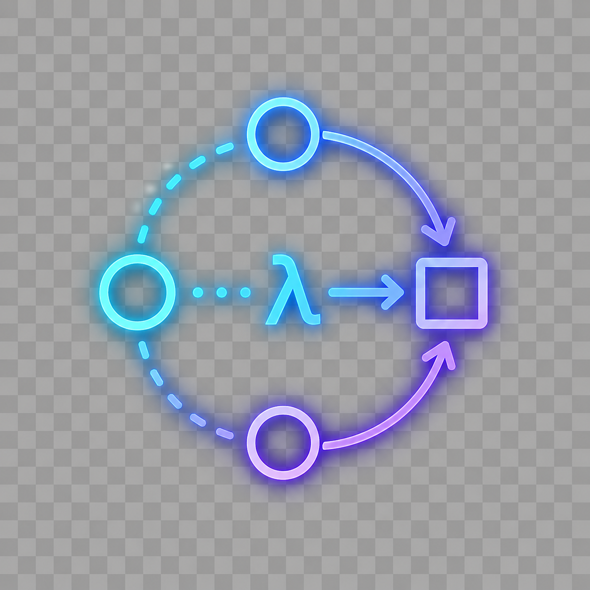
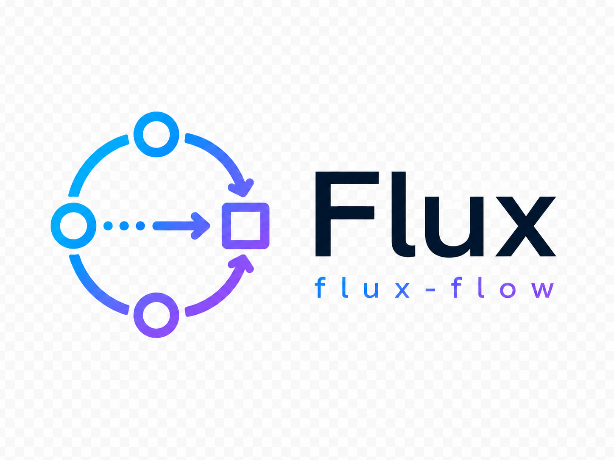
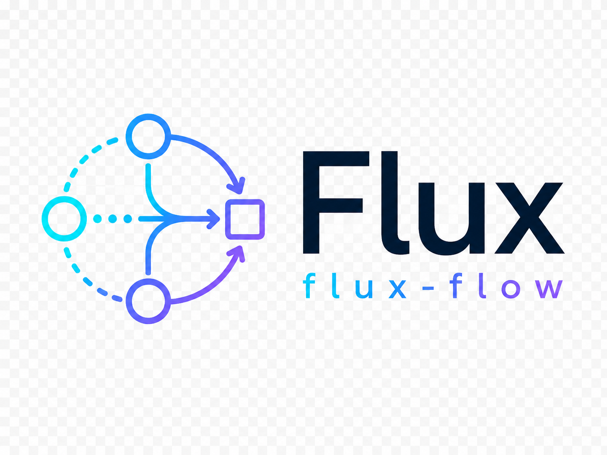
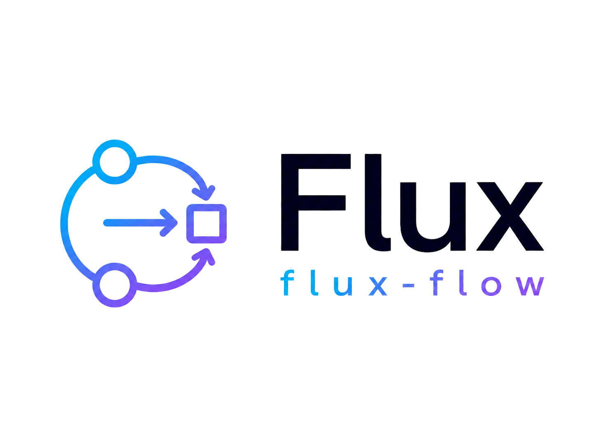
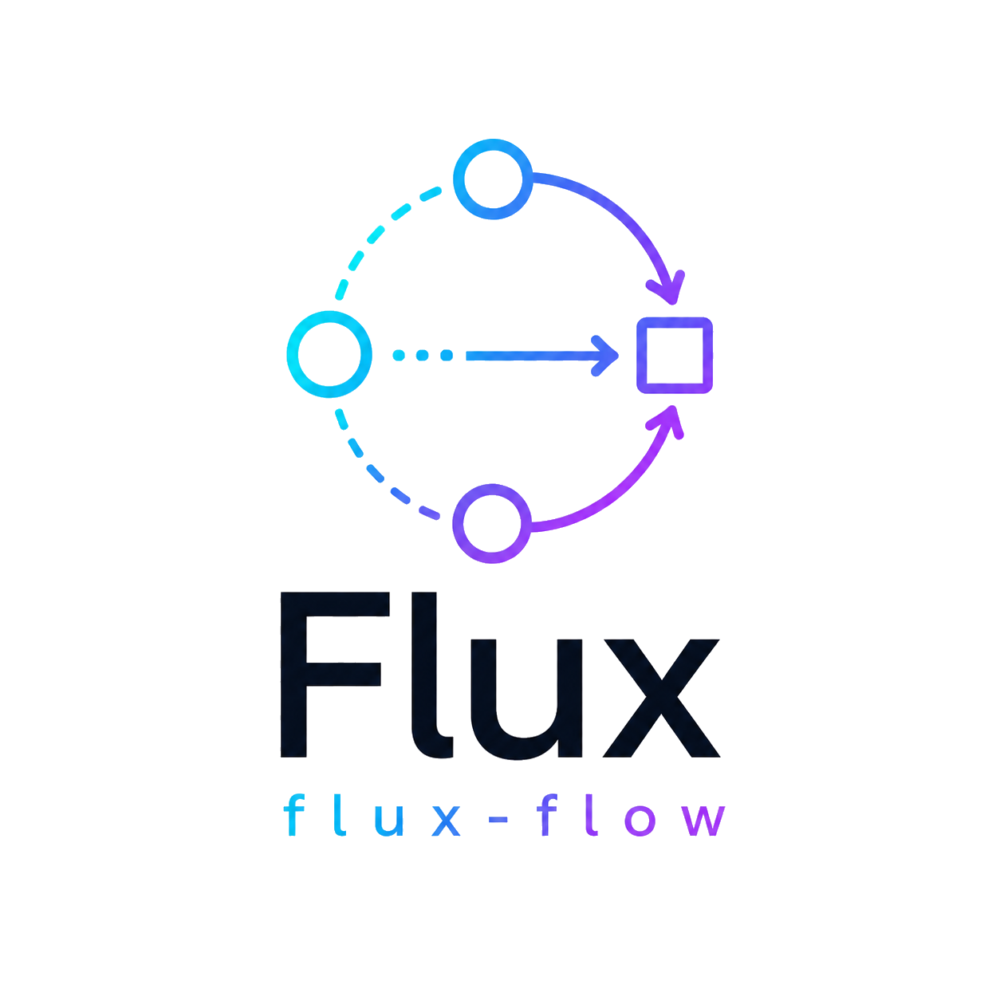
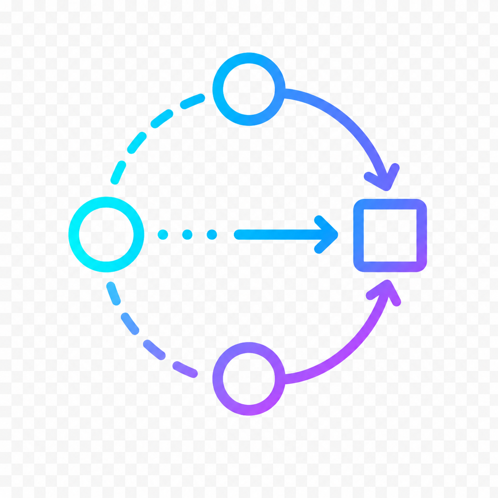

# Flux brand assets

Logo, icon, and mascot artwork for the **Flux** / *flux-flow* project.

The shared motif is the **flow graph** — input nodes (on a dashed arc) flowing through a transform
(`λ`) into an output square — representing Flux's typed-AST, LLM-as-compiler execution model.

`flux-logo.svg` is the **source of truth**: a hand-built vector with crisp edges, true transparency,
and a gradient that reads on both light and dark backgrounds. `flux-logo.png` is rendered from it for
the project `README.md`. The remaining `logo-*` / `icon` PNGs are the original generated variants.

## Images

| Preview | File | Dimensions | Background | Purpose / when to use |
| --- | --- | --- | --- | --- |
|  | `flux-logo.svg` / `flux-logo.png` | vector / 1496×560 | Transparent | **Primary logo / README hero.** Sharp, flat (no glow) horizontal lockup: flow mark + "Flux / flux-flow" wordmark. Edit the `.svg` and re-render the `.png` (`rsvg-convert -h 700 flux-logo.svg \| magick - -trim +repage -bordercolor none -border 36 flux-logo.png`). |
|  | `logo-neon.png` | 1254×1254 | Transparent | Icon-only neon `λ` mark (generated). Reads best on dark surfaces. |
|  | `logo-horizontal.png` | 1448×1086 | Transparent | Generated horizontal lockup: circular flow icon (3 nodes + dotted arrow → square) left of the wordmark. |
|  | `logo-horizontal-dashed.png` | 1448×1086 | Transparent | Horizontal lockup variant with an open **dashed-arc** flow icon. Airier feel. |
|  | `logo-horizontal-bold.png` | 1448×1086 | Transparent | Horizontal lockup variant with a **bold solid-circle** icon. Stronger at small sizes. |
|  | `logo-stacked.png` | 1254×1254 | Transparent | Flow icon centered **above** the wordmark. Use in square/portrait slots. |
|  | `icon.png` | 1254×1254 | Transparent | Clean cyan→purple flow mark, no wordmark. Source for favicons / app icons. |
|  | `avatar.png` | 1254×1254 | Dark (scene) | Friendly Flux assistant/agent character. Use as the agent persona avatar in chat UIs and social profiles — **not** as the project logo. |

> The generated `logo-*` / `icon` PNGs were delivered flattened (a fake checkerboard painted in place
> of a real alpha layer); their transparency was recovered by color-keying, so their edges are not
> pixel-perfect. Prefer `flux-logo.svg`, or re-export the others from the design source with a true
> alpha channel.

## Choosing one

- **README / general logo →** `flux-logo.svg` (or `flux-logo.png`)
- **Icon-only on a dark surface →** `logo-neon.png`
- **Square / centered slot →** `logo-stacked.png`
- **Favicon / app icon / inline mark →** `icon.png`
- **Representing the agent itself →** `avatar.png`
